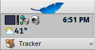
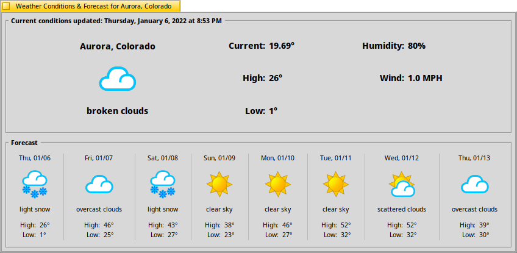
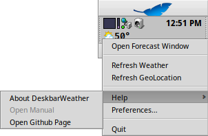
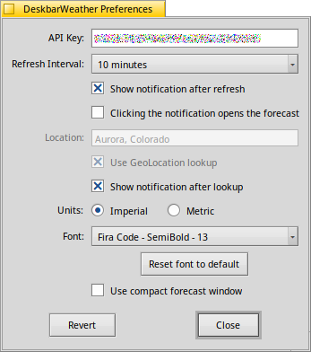
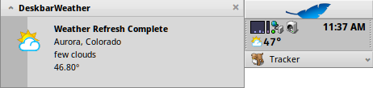
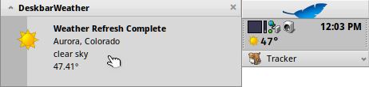
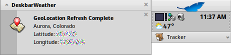
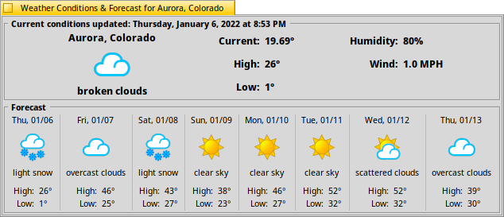

.. title:: DeskbarWeather User Guide

.. toctree::
   :maxdepth: 2
   :hidden:

.. contents:: User Guide Contents
   :depth: 3
   :local:
   :backlinks: none

Deskbar Operation
-----------------

+----------------------------+-----------------------+-------------------------+
|  Left click to show or     | Middle click to start | Right click to show the |
|  hide the forecast window  | a weather refresh     | popup menu              |
+----------------------------+-----------------------+-------------------------+
|      |ForecastScreen|      |                       |      |PopUpMenu|        |
+----------------------------+-----------------------+-------------------------+
| *Note: The escape key will |                                                 |
| also hide the window*      |                                                 |
+----------------------------+-------------------------------------------------+

Command Line Options
--------------------

DeskbarWeather has several command line options to allow control by the `Shortcuts` preferences application included with Haiku.

.. code-block:: none
   :class: terminal

   ~> DeskbarWeather --help
   Usage: DeskbarWeather [option]
        --forecast              Show forecast window
        --refresh               Refresh weather
        --geolookup             Refresh geolocation

Preferences
-----------

Refresh Interval
^^^^^^^^^^^^^^^^

Set how often the weather conditions should be updated.

When "Manual refresh only" is selected then the updates will only happen by choosing the "Refresh Weather" menu item or by using the `command line options <#command-line-options>`_.

Show notification after refresh
^^^^^^^^^^^^^^^^^^^^^^^^^^^^^^^

Show a system notification after each succesful weather refresh.

*Note: Error messages are always shown regardless of this setting.*

Clicking the notification opens the forecast
^^^^^^^^^^^^^^^^^^^^^^^^^^^^^^^^^^^^^^^^^^^^

Location
^^^^^^^^

Override the displayed city/region name that is returned by OpenWeatherMap.

Use GeoLocation lookup
^^^^^^^^^^^^^^^^^^^^^^

Automatically use the `ip-api <https://ip-api.com>`_ geolocation service to look up latitude and longitude.

*Note: No system information is transmitted. Only what the Haiku HttpRequest uses to make the request.*

Show notification after lookup
^^^^^^^^^^^^^^^^^^^^^^^^^^^^^^

*Note: The notification will indicate whether a cached location is being used.*

Units
^^^^^

**Imperial** diplay degrees fahrenheit and miles per hour.

**Metric** display degrees celsius and kilometers per hour.

Font
^^^^

Select a font other than the standard Deskbar font.

Use compact forecast window
^^^^^^^^^^^^^^^^^^^^^^^^^^^

Reduce the margins and padding of the forecast window for smaller screen resolutions or people who like a cozy layout.

